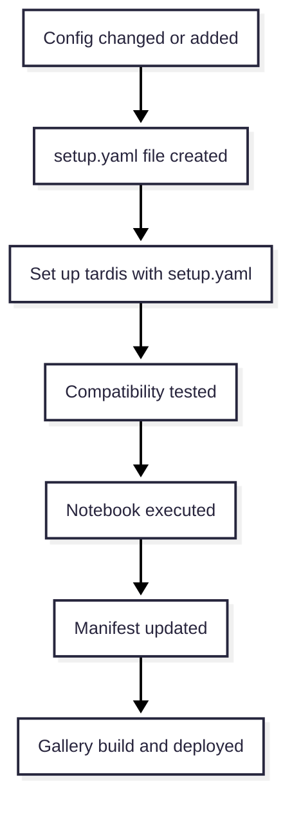
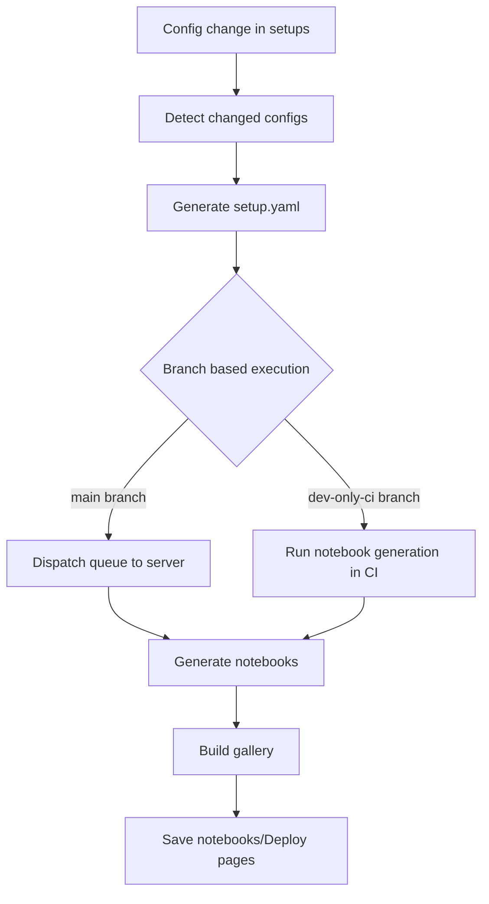

**GSOC’26 Proposal \- TARDIS**

**TARDIS Setups Generated Plots and Gallery**

Name: Aaryan Dadu   
Email: [aaryandadu.work@gmail.com](mailto:aaryandadu.work@gmail.com)  
Github username: [Aaryan-Dadu](https://github.com/Aaryan-Dadu)  
Linkedin: [Aaryan Dadu](https://in.linkedin.com/in/aaryan-dadu-034652341)  
Resume: [Resume](https://drive.google.com/file/d/1bSmvWSUlxoS0sb1tBpK4NAXN2cyLnT6e/view?usp=sharing)

**About Me:**

I am Aaryan Dadu, an undergraduate student in Bachelor’s of Technology in Computer Science in Indian Institute of Information Technology, Lucknow, India. I have python programming experience of 3 years and open-source experience of 1 year. I started my open source journey from the previous year only, starting from contributing in my college projects to contributing to major organisations like TARDIS-sn I gained a decent gist and feel of open source at the very least. My github shows work on Python, C/C++, and scientific tools. For example, I built [*SandPaper*](https://pypi.org/project/sandpaper-py/), a Python CLI based scraper (published on PyPI). I also led *Courier-3*, a full-stack decentralized email project using typescript, Node.js and Solidity. I am good at system design.I have been actively engaged in competitive programming on platforms like codeforces, and even wrote an article for cp-algorithms. My skills and experience will greatly help in completion of the project.

**Commitment:**

* No plans of any vacations during GSOC period.  
* No other employment during GSOC period.  
* I intend to work for 350 hours and around 40 hours per week

**Previous Contributions:**

* [PR3351](https://github.com/tardis-sn/tardis/pull/3351): [Remove qgridnext from workflows and pyproject](https://github.com/tardis-sn/tardis/pull/3351)  
* [PR3479](https://github.com/tardis-sn/tardis/pull/3479): [First Objective of TARDIS Setups Generated Plots and Gallery project](https://github.com/tardis-sn/tardis/pull/3479)  
* [PR3454](https://github.com/tardis-sn/tardis/pull/3454): [use previous iteration ion populations as first guess in NLTE solver](https://github.com/tardis-sn/tardis/pull/3454)   
* [PR3468](https://github.com/tardis-sn/tardis/pull/3468): [fix FileNotFoundError in regression tests](https://github.com/tardis-sn/tardis/pull/3468)  
* [PR3433](https://github.com/tardis-sn/tardis/pull/3433): f[ix test\_convergence\_plot\_command\_line](https://github.com/tardis-sn/tardis/pull/3433)  
* [PR3426](https://github.com/tardis-sn/tardis/pull/3426): [remove pyne from codebase](https://github.com/tardis-sn/tardis/pull/3426)  
* [PR3413](https://github.com/tardis-sn/tardis/pull/3413): [implement export functionality for convergence plots to png or ascii table](https://github.com/tardis-sn/tardis/pull/3413)  
* I have been very active in helping in the issues or PRs in which I have knowledge about, like [sharing my findings](https://github.com/tardis-sn/tardis/issues/3091#issuecomment-3886223647), and helping others in their PRs when they got stuck like [helped in coverage](https://github.com/tardis-sn/tardis/pull/3507#issuecomment-4088076250), [helped in git stuff](https://github.com/tardis-sn/tardis/pull/3481#issuecomment-4012671075) and had been active in the community channel for Tardis too.  
* One thing I want to point out is that out of my 7 PRs, 1 PR is merged, 2 have been accepted, 1 is the first objective, 3 are under discussion and none got closed.  
* I have been involved with Tardis from the end of November 2025 till now and intend to be part for much longer even if I get selected or not. So, thank you to the mentors for such a great experience.

**Project Summary:**

In this whole proposal “**setup**” is a config file or a model for tardis, and “**set up**” is used to indicate that we are making something ready and “**repo**” and “**tardis-setups**” has been used interchangeably.

* Currently the [tardis-setups](https://github.com/tardis-sn/tardis-setups) has models that are used in scientific studies but not much one can infer from those inputs, so I will revamp the whole tardis-setups repository and make it a browsable, more accessible but will still retain the purpose of the tardis-setups repository i.e., all changes will comply to [CCA 4.0](https://github.com/tardis-sn/tardis-setups?tab=CC-BY-4.0-1-ov-file).   
* From the perspective of a user it would be like a [web page](https://aaryan-dadu.github.io/tardis-proposal-demo/) which would have listed all the models present in tardis-setups with a brief overview about it and the user will have the ability to view and interact with the jupyter notebook which have the visualisations of that model using the various visualisation tools offered by tardis.   
* From a user who would have to browse various config files, set the environment to run them, then try them out themself and then repeat it until they found their starting point, to this browsable gallery like feature which would reduce all of these steps, this would add convenience for them and also for all others who are new to tardis and are looking for a starting point.   
* From the perspective of a researcher they would have to raise the PR for their config and the CI would do the rest, so no extra work to be done by researcher even in new revamped tardis-setups repository.  
* By the design choice of implementation of this project tardis-setup will also have two major additional benefits, first is that the old configs will have the precise set up instruction now with the tardis version pinned and the installation instruction for that version thus better reproducibility for the research papers configurations, thus locally also one can just look up the set up file for that config and use it accordingly, second benefit will be that there we will have a [template notebook](https://github.com/Aaryan-Dadu/tardis-proposal-demo/blob/dev-only-ci/templates/config_report_template.ipynb) that would have the capability to utilise the full potential of tardis visualisation tools and anyone can pass config file and atomic data files to it and the notebook will get ready. 

**Project Description:**

I will divide the project into two parts, the first part would be to handle the new configs committed, the second one to process and create the notebook for older configs.  
**Demo:** [Tardis Proposal Demo](https://github.com/Aaryan-Dadu/tardis-proposal-demo) and [Tardis Proposal Demo Webpage](https://aaryan-dadu.github.io/tardis-proposal-demo/)  
Please check the [dev-only-ci](https://github.com/Aaryan-Dadu/tardis-proposal-demo/tree/dev-only-ci) branch for the prototype which only relies on CI runner.  
**The architecture or user level view to it would be like this,** 

* The user will create a PR to add a new config in the repo, a CI test will run which if the config would be compatible with the latest release of tardis it will pass and the config can be easily merged else the user would have to specify the tardis version they used for running it.  
* When the config will get merged, a [setup.yaml](https://github.com/Aaryan-Dadu/tardis-proposal-demo/blob/main/setups/2026/GSOC_2026_Paper/setup.yaml) will be generated which particularly specifies the required details like the tardis version to be used for the config, the author, the date, and installation instructions for that tardis version.  
* The CI will dispatch it as a job to the server or if we don’t have a server to run then we can run it in the github CI runner and the server/CI runner will generate a notebook in a specified output folder, from there the CI will deploy the new notebook with an overview of that config to the web page based upon github-pages and from their the user will be able to visualize the plot, using the tools of tardis.

**Internally, it will run like this,**  
NOTE: As per the discussion with the mentors we may or may not use the server to create the notebook that’s why [only github CI](https://github.com/Aaryan-Dadu/tardis-proposal-demo/blob/dev-only-ci/.github/workflows/dev-only-ci.yml) can also be used for that and most of the things remain same and after we are sure whether to use server or CI we can stick to one and need not implement for both. So I have proposed both CI and server based approaches as they differ just slightly.

* After the PR, the [CI will run](https://github.com/Aaryan-Dadu/tardis-proposal-demo/blob/main/.github/workflows/prototype-approach-4.yml) the test(this test is not a standard way, it’s a creative idea from my side to test the compatibility of the config with the latest version of tardis) in which CI will set up the latest version of tardis and run a minimal config for a particular config basically with reduced no. of iterations, reduced no. of packets, virtual packets, and reduced last no. of packet, like 4 iterations, 10 packets, 4 virtual packets, 20 last no. of packet. This test is based upon my research that few of the configs can become incompatible with few versions of tardis at some point of time or could simply get deprecated. It’s a bit creative but I think it took the CI in my prototype around 1-2 minutes on average across 25 commits for my free tier github CI runner and the minimal config ran for just 3-5 seconds making the test to last just 2 minutes. I thought this would be the best test instead of finding out each and every way the configs can be incompatible as there are many ways in which they could fail in the future.  
* If CI fails then the author would have to specify the version of tardis it used for running the config. Otherwise the PR can be cleanly merged. After a script will run by the workflow to check if the commit is for adding a config or is it unrelated.  
* The updated or added configs are listed and then for them a setup.yaml will be generated using a script similar to the script in [First Objective PR](https://github.com/tardis-sn/tardis/pull/3479). This setup.yaml contains instructions for installing and setting up the current version of tardis.  
* These configs will then be dispatched to be executed by the server or if we don’t have a server we will run it the CI runner.  
* The server side scripts or CI runner scripts will run.  
* In the server using the setup.yaml the conda environment will be created if the setup.yaml doesn’t point to the latest tardis, if it points to latest tardis then we don’t need to create a new conda environment. In only CI approach we don’t require to do this as the environment is already set.  
* The script will inject the configs, atomic data, etc to the template notebook we have in the repo. The notebook will run and it will get saved in the [out/ of each config](https://github.com/Aaryan-Dadu/tardis-proposal-demo/tree/main/out) folder or to a [common out/](https://github.com/Aaryan-Dadu/tardis-proposal-demo/tree/dev-only-ci/out) folder.  
* The CI will run the job for gallery deployment and will deploy the notebook with a brief overview, author details, and link to the config.  
* It’s a proposed design, the architecture can easily be changed or redesigned as per the requirement given the time frame we have for the program.

**The second part will be to make the notebooks for older configs,**

* The notebooks can easily be generated for the older configs using the same flow. But there are few issues, related to stability and compatibility with the latest version of tardis.  
* The first is that many configs have a local path to atomic data file, but this can be resolved without altering the config by injecting the atom data file in the run\_tardis based upon the file name in the config.  
* Like the setups in the [tardis-setups/integration\_tests/](https://github.com/tardis-sn/tardis-setups/tree/master/integration_tests) has the key ![][image3]   
  which is deprecated, few configs like [2022/2019eix/29d.yml](https://github.com/tardis-sn/tardis-setups/tree/master/2022/2019eix) and few others have shape mismatch error. So, in some cases where the tests would fail we can either leave notebook generation for them or we can specify the version of tardis for which they would be compatible.  
* There are already two PRs for resolving the shape mismatch error which are these [PR3188](https://github.com/tardis-sn/tardis/pull/3188) and [PR3514](https://github.com/tardis-sn/tardis/pull/3514) so I don’t think I would need to make a PR for it as it would not be a good open source etiquette when already a PR is open for it. So, once any of those gets merged the few other configs will be compatible with the current version of tardis too.  
* But the second part does not end here, the thing is that at some point of time in near future all the latest configs will become older configs and with time more visualisation tools will get ready, may be some breaking change would also come which might change the physics drastically or just gradual development may make the generated notebooks **not so correct**.  
* We need to ensure that notebooks also update, so the best way would be to add a job to run and update all the notebooks after a fixed duration like 3 months to the latest version of tardis and if it’s not compatible with latest tardis the CI fails for that config and all changes for that config are rolled back. But this would load the CI/server every 3rd month so to overcome that sudden overhead we will distribute the whole notebook generation throughout a time period so no update occurs one same day or same week it will be spread out across a time frame. This way no manual intervention or maintenance overhead would incur.  
* Else if we don’t want to update notebooks we can just leave the notebooks in a **not so correct** state for always whichever way we wanna do this.

**Assumptions:**

* As per my understanding the configs present in repo must not be tempered so as to ensure scientific reproducibility and to adhere to CCA 4.0 license as [mentioned](https://github.com/tardis-sn/tardis-setups?tab=readme-ov-file#tardis-setups) in the repo.

**Key Deliverables:**

I have already created a [prototype](https://github.com/Aaryan-Dadu/tardis-proposal-demo) showcasing that these milestones are very well achievable under the time constraint without compromising with the quality of code.

* Automated config-to-notebook generation pipeline integrated with GitHub CI runners.  
* setup.yaml generation per config with TARDIS version \+ environment setup details and other relevant details.  
* CI-only execution mode or server mode whichever gets finalized with mentors.  
* Extendable template notebook capable of generating major visualisation outputs and utilising full potential of visualisation tools offered by tardis.  
* Gallery website generation flow with searchable/browsable notebook entries and links to source configs with an overview of the configuration and preview of the generated notebooks.  
* Strategy and implementation for processing older configs with compatibility handling.  
* Documentation for contributors and maintainers to operate, debug, and extend the pipeline.  
* Else if we don’t want to update notebooks we can just leave the notebooks in a **not so correct** state for always whichever way we wanna do this so this is a **stretch goal**.

**Project Timeline:**

Community Bonding Period: Interact and discuss more about the requirements and to find the best way to implement this plan.

* **Week 1:** Finalize project scope with mentors, and decide architecture choice (server \+ CI or  CI-only), finalize acceptance criteria for generated notebooks and gallery output.  
* **Week 2:** Create changed-config detection and setup.yaml generation flow for new configs, including edge cases for unrelated commits and non-config file changes.  
* **Week 3:** Integrate version resolution in setup.yaml generation (latest vs pinned), and improve atomic data handling for configs containing local paths.  
* **Week 4:** Finalize CI-only execution path for full notebook generation without server dependency. Or finalize server side logic (if selected by mentors), pull-back of notebooks/artifacts, and handling server secrets.  
* **Week 5:** Improve notebook template to cover TARDIS visualisation tools reliably (SDEC, LIV, RPacketPlotter, widgets with static fallback where needed) and make it easily expandable for future ease.  
* **Week 6:** Build/Improve gallery generation pages with overview metadata, links to config, links to notebook HTML, and better discoverability.  
* **Week 7:** Testing and correcting the end to end implementation for the first part of the project and adding suitable tests for individual units and improving logs.  
* **Week 8:** Generate the notebooks for the older configs present in the repo using the pipeline created.  
* **Week 9:** Add scheduled notebook refresh strategy to update the notebooks from time to time to stay up-to-date and manage CI load distribution for this task across a time frame. This is a stretch goal and can be skipped as per the discussion with mentors.  
* **Week 10:** Documentation pass: architecture, user guide, maintainer guide, troubleshooting, and reproducibility notes around setup.yaml usage.  
* **Week 11:** Buffer week for mentor feedback, refinements, bug fixes, final polish, and final report with demo walkthrough.