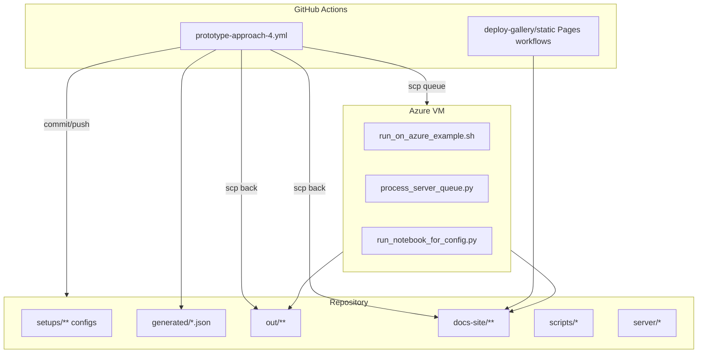
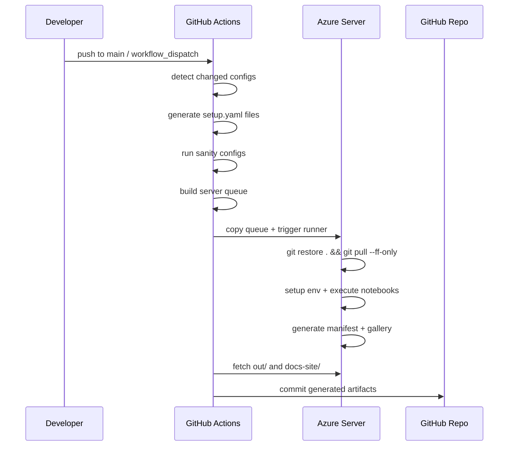

# 🏗️ Implementation Architecture

## Component View

## Runtime Sequence

## Responsibility Split

- **CI job**
  - Orchestration, validation, dispatch, publishing
- **Server scripts**
  - Environment provisioning and notebook execution
- **Gallery script**
  - Rendered HTML notebook previews and index generation
- **Pages workflows**
  - Deploy static content from `docs-site/`
