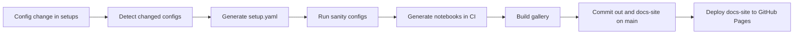

# Implementation Architecture

This prototype runs a main-only CI pipeline for notebook generation and gallery publishing.

## End to end flow

## Components

- `scripts/detect_changed_configs.py`: finds changed config files
- `scripts/generate_setup_yamls.py`: creates per-config setup metadata
- `scripts/create_sanity_configs.py`: creates lightweight configs for sanity checks
- `scripts/run_setup_yaml_sanity.py`: validates setup and reduced runs
- `scripts/run_full_notebook_generation.py`: full notebook generation in CI
- `scripts/build_gallery.py`: static gallery build
- `.github/workflows/dev-only-ci.yml`: main CI pipeline (incremental notebook + gallery flow)
- `.github/workflows/static.yml`: GitHub Pages deployment workflow

## Output

- `generated/changed-configs.json`: detected changed setup configs
- `generated/setup-generation-manifest.json`: setup generation records
- `generated/sanity-manifest.json`: reduced sanity run inputs
- `generated/sanity-results.json`: sanity execution results
- `out/notebook-manifest.json`: notebook manifest for gallery
- `docs-site/`: final static pages
