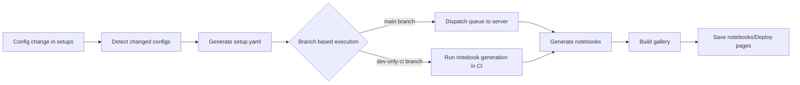

# Implementation Architecture

This prototype has two implementation ways by branch:

- `main` branch: server based flow with CI orchestration
- `dev-only-ci` branch: CI runner only flow

## End to end flow

## Components

- `scripts/detect_changed_configs.py`: finds changed config files
- `scripts/generate_setup_yamls.py`: creates per-config setup metadata
- `scripts/run_full_notebook_generation.py`: full notebook generation in CI-only flow
- `server/process_server_queue.py`: server-side queue execution
- `scripts/build_gallery.py`: static gallery build

## Output

- `generated/setup-generation-manifest.json`: setup generation records
- `out/notebook-manifest.json`: notebook manifest for gallery
- `docs-site/`: final static pages
