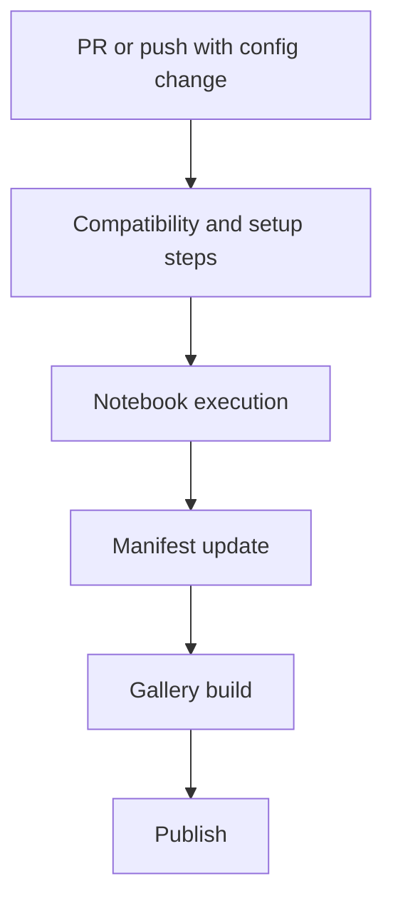

# Design Document

## Goal

Make `tardis-setups` easier to explore by auto-generating notebooks and publishing a browsable gallery, while preserving reproducibility from configuration files present in it.

## Core design points

- Keep config source unchanged
- Generate setup metadata per config
- Use a single main-branch CI execution path for config compatibility testing, notebook generation, and gallery build
- Keep gallery static and easy to host on GitHub Pages
- Keep runs observable through JSON manifests

## Runtime model

## Why this works

- Researchers only submit configs, or make changes to it
- Pipeline handles environment and execution details
- New users get direct visual outputs without manual setup loops
