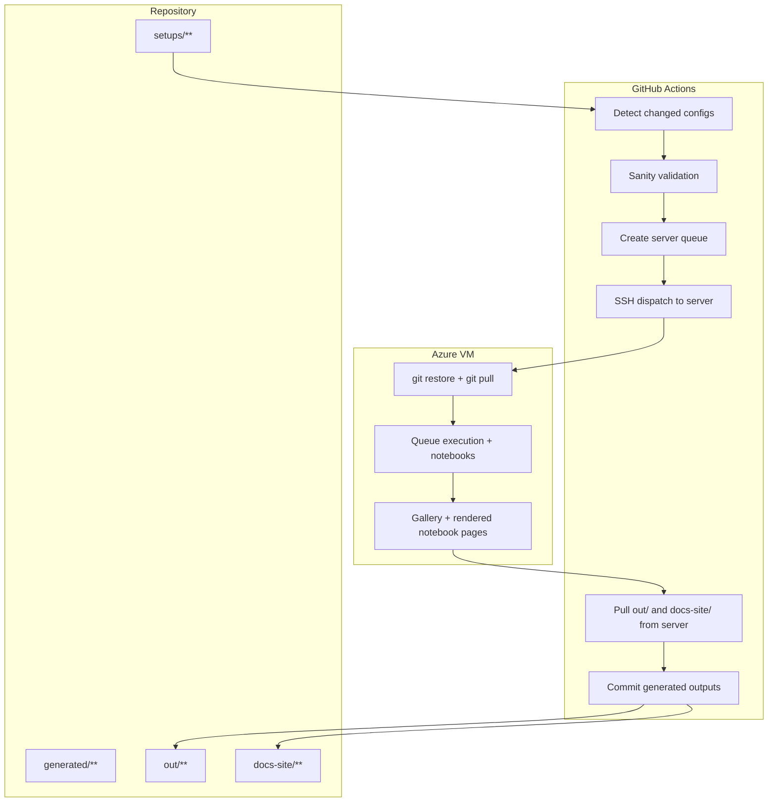
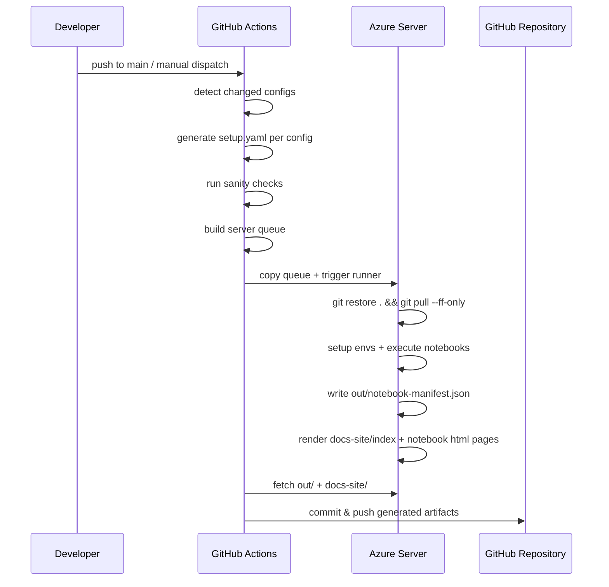
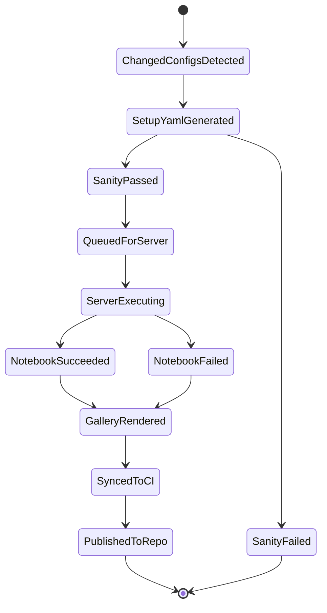
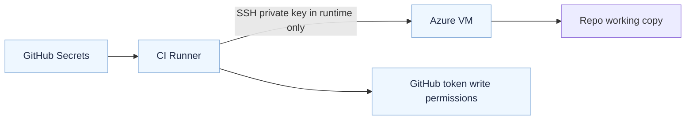

# 🧭 Design Document (Main)

This document is the primary implementation design for the TARDIS Approach-4 notebook automation pipeline.

## 1) Context and Motivation

TARDIS notebooks are computationally expensive and involve heavy environment setup. A direct "run everything in CI" model is slow, costly, and brittle.

This design separates responsibilities:
- CI handles orchestration, safety checks, and publication.
- A dedicated server handles full notebook execution.
- Generated outputs are synchronized back to the repository and deployed as static pages.

## 2) Product Goals

### Functional Goals ✅
- Process only changed setup configs.
- Validate candidate configs in CI before server dispatch.
- Generate executed notebooks and a gallery view.
- Persist machine-readable run status for debugging.

### Quality Goals ✅
- Reproducibility through per-config setup metadata.
- Traceability for failures (`reason`, `returncode`, `stderr_tail`).
- Operational simplicity (minimal manual intervention).
- Publishable artifacts for collaboration and review.

### Non-goals 🚫
- Replacing upstream TARDIS physics workflows.
- Full distributed scheduling system.
- Long-term artifact archival beyond repository history.

## 3) Operating Scope

Execution entry points:
- Push-triggered automation (`main` branch)
- Manual workflow dispatch

Primary outcomes:
- generated notebooks under `out/`
- manifest-based execution status in `out/notebook-manifest.json`
- rendered gallery output under `docs-site/`

## 4) Architecture Overview

## 5) End-to-End Runtime Sequence

## 6) Lifecycle State Model

## 7) Data Contracts

### 7.1 Queue contract: generated/server-queue.json

Required per item:
- `config`
- `setup_yaml`
- `atom_data`

Semantic meaning:
- One queue row = one full server execution unit.

### 7.2 Manifest contract: out/notebook-manifest.json

Required per item:
- `config`
- `notebook`
- `notebook_exists`
- `setup_yaml`
- `env_name`
- `status`
- `reason`
- `returncode`
- `stderr_tail`

Semantic meaning:
- Single source of truth for run outcomes and user-visible gallery state.

## 8) Core Design Decisions

### 8.1 Server execution over full CI execution

Decision:
- Run full notebooks on dedicated VM, not standard CI runners.

Benefits:
- Predictable CI runtime and cost.
- Better control over heavy runtime dependencies.
- Lower risk of CI timeout for long notebook workloads.

Tradeoff:
- Adds SSH/secrets operational complexity.

### 8.2 Per-config setup metadata (`setup.yaml`)

Decision:
- Materialize execution intent per config as setup metadata.

Benefits:
- Reproducible environment setup.
- Clear traceability of requested TARDIS ref and dependency source.
- Easier debugging when a specific config fails.

Tradeoff:
- Additional generation and maintenance layer.

### 8.3 CI as publisher (server does not push)

Decision:
- Server produces outputs; CI pulls and pushes.

Benefits:
- Centralized audit trail in one publishing identity.
- Simpler server permissions model.
- Better control of publication policy in workflows.

Tradeoff:
- Requires SCP sync-back step.

### 8.4 Rendered notebook pages in gallery

Decision:
- Generate HTML-rendered notebook pages from `.ipynb`.

Benefits:
- Faster review without opening notebooks locally.
- Better readability for non-developer collaborators.
- More user-friendly static site experience.

Tradeoff:
- Extra render time and storage.

### 8.5 Pre-run server sync hard reset

Decision:
- Run `git restore .` followed by `git pull --ff-only` on the server before queue execution.

Benefits:
- Eliminates drift from accidental server-side edits.
- Ensures the server always executes the exact latest repository code.
- Reduces “works on VM but not in repo” inconsistencies.

Tradeoff:
- Any uncommitted tracked server changes are discarded at run start.

### 8.6 Manifest-first observability contract

Decision:
- Treat `out/notebook-manifest.json` as the authoritative status interface for all runs.

Benefits:
- Uniform debugging surface for CI logs, gallery, and operator checks.
- Enables deterministic status rendering (`ok`/`failed`) in UI.
- Supports quick triage using `reason`, `returncode`, and `stderr_tail`.

Tradeoff:
- Requires consistent schema discipline across producer scripts.

### 8.7 Per-item environment lifecycle cleanup

Decision:
- Create environment per queue item and clean it after execution.

Benefits:
- Prevents disk growth from stale conda environments.
- Improves isolation between config runs.
- Lowers risk of cross-run contamination from cached packages/state.

Tradeoff:
- Additional environment setup time per item.

### 8.8 Sanity-first dispatch gating

Decision:
- Dispatch server workload only for configs that pass CI sanity checks.

Benefits:
- Reduces expensive server usage on obviously invalid inputs.
- Keeps queue quality high and lowers failure noise.
- Improves turnaround for valid configs by avoiding bad-job contention.

Tradeoff:
- Adds one extra pre-dispatch stage in CI.

### 8.9 Atom-data auto-resolution before notebook execution

Decision:
- Resolve and, when required, auto-download atom data before notebook execution.

Benefits:
- Prevents common runtime failures caused by missing atom data files.
- Improves portability across fresh or rotated server environments.
- Keeps notebook template logic simpler by shifting data readiness to runner layer.

Tradeoff:
- Introduces network dependency during execution preparation.

### 8.10 Static gallery with embedded preview controls

Decision:
- Publish static HTML gallery with rendered notebook pages and inline preview controls.

Benefits:
- Zero backend hosting complexity (works with GitHub Pages).
- Fast browsing and filtering of results for reviewers.
- Preserves downloadable raw notebook artifacts for reproducibility.

Tradeoff:
- Large notebook outputs can increase page and artifact size.

## 9) Failure and Recovery Model

| Stage | Failure Type | Detection | Recovery |
|---|---|---|---|
| CI sanity | config/setup invalid | non-zero exit, sanity results | fix config/setup, rerun |
| Server dispatch | missing secrets/SSH | dispatch gating + step failure | update secrets/keys |
| Env setup | dependency resolution error | manifest `setup_env_failed` | adjust setup metadata or package source |
| Notebook execution | runtime/data error | manifest `notebook_execution_failed` + `stderr_tail` | inspect traceback and rerun |
| Gallery render | conversion/build failure | build step failure | fix renderer/deps and rerun |
| Publish step | git push conflict | CI commit/push step failure | rerun with latest main |

## 10) Security and Trust Boundaries

Key practices:
- Secret gating before dispatch.
- No server-side autonomous push path.
- Server starts with clean sync to reduce drift.

## 11) Current Execution VM Profile (ad-tardis)

The current production-like execution server profile (provided by operator) is:

### 11.1 VM identity
- **Name**: `ad-tardis`
- **Region**: East Asia (Zone 1)
- **OS**: Ubuntu 24.04 (Linux)
- **Architecture**: x64
- **VM Generation**: V2
- **Hypervisor**: Microsoft Hyper-V

### 11.2 Compute
- **VM size**: `Standard B2als v2`
- **vCPU**: 2
- **RAM**: 4 GiB
- **CPU class**: AMD-based burstable B-series (`a` variant)

Interpretation:
- Burstable CPU model with credit-based performance.
- Suitable for periodic heavy jobs, not ideal for sustained 100% CPU workloads.

### 11.3 CPU credit model (operationally important)
- **Initial credits**: 60
- **Credits earned/hour**: 36
- **Max credits**: 864

Implication for this pipeline:
- Notebook workloads can burst to full CPU briefly.
- Long continuous runs can deplete credits and throttle throughput.
- Queue sizing and run frequency should account for credit recovery.

### 11.4 Storage and IO
- **OS disk**: Managed disk (max up to 1023 GiB)
- **Data disks attached**: 0
- **Max supported data disks**: 4
- **Uncached IOPS**: ~3750
- **Disk throughput**: ~85 MB/s
- **Local temp disk**: none
- **Premium SSD**: supported

### 11.5 Network
- **Public IP**: `57.158.x.x`
- **Private IP**: `10.0.0.4`
- **Max NICs**: 2
- **Accelerated networking**: supported
- **VNet/Subnet**: `ad-tardis-vnet` / `default`

### 11.6 Security posture
- **Trusted launch**: enabled
- **Secure Boot**: enabled
- **vTPM**: enabled
- **Disk encryption**: not enabled

### 11.7 Virtualization features
- **Nested virtualization**: not enabled
- **GPU**: not available

### 11.8 Design impact summary

For this hardware tier, pipeline reliability depends on:
- Running sanity checks in CI first (avoid unnecessary heavy server runs)
- Keeping execution environments cleaned up after jobs
- Avoiding large concurrent notebook batches that can trigger sustained throttling
- Preserving strong failure telemetry in manifest for quick reruns

## 12) Operational Model

### 12.1 Before server run
- Server runner performs:
   - `git restore .`
   - `git pull --ff-only`

### 12.2 During run
- Queue consumed item-by-item.
- Environment is created, notebook executed, manifest updated.

### 12.3 After run
- Gallery generated from manifest and notebooks.
- CI syncs output folders and publishes.

## 13) Observability

Primary observability channels:
- GitHub Actions logs
- `out/notebook-manifest.json`
- gallery status badges and failure reason cards

Recommended checks:
- queue count > 0 before dispatch
- manifest rows match queue rows
- `notebook_exists` consistency with filesystem

## 14) Constraints and Assumptions

Assumptions:
- VM has stable network + conda + git.
- Secrets are valid and current.
- Repository default branch is accessible and fast-forwardable.

Constraints:
- notebook rendering can be resource-intensive.
- external dependency availability (package indexes, data downloads).

## 15) Planned Enhancements

- Incremental rendering (only changed notebooks)
- Retry strategy for transient setup/download failures
- Optional artifact offloading for very large notebook outputs
- richer dashboard metrics from manifest history

## 16) Related Documents

- Architecture details: [ARCHITECTURE.md](ARCHITECTURE.md)
- User runbook: [USER_GUIDE.md](USER_GUIDE.md)
- Server setup: [SERVER_SETUP.md](SERVER_SETUP.md)
- Environment model: [ENVIRONMENTS.md](ENVIRONMENTS.md)
- Secrets model: [SECRETS.md](SECRETS.md)