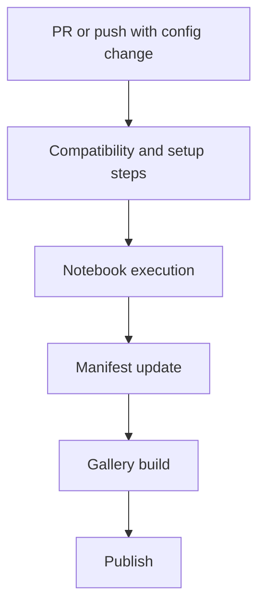

# Design Document

## Goal

Make `tardis-setups` easier to explore by auto-generating notebooks and publishing a browsable gallery, while preserving reproducibility.

## Core design points

- Keep config source unchanged
- Generate setup metadata per config
- Keep two branch based ways: server based on `main`, CI runner only on `dev-only-ci`
- Keep gallery static and easy to host on GitHub Pages
- Keep runs observable through JSON manifests

## Runtime model

## Non goals

- No mandatory live backend for notebook viewing
- No rewriting of historical config content

## Why this works

- Researchers only submit config changes
- Pipeline handles environment and execution details
- New users get direct visual outputs without manual setup loops
